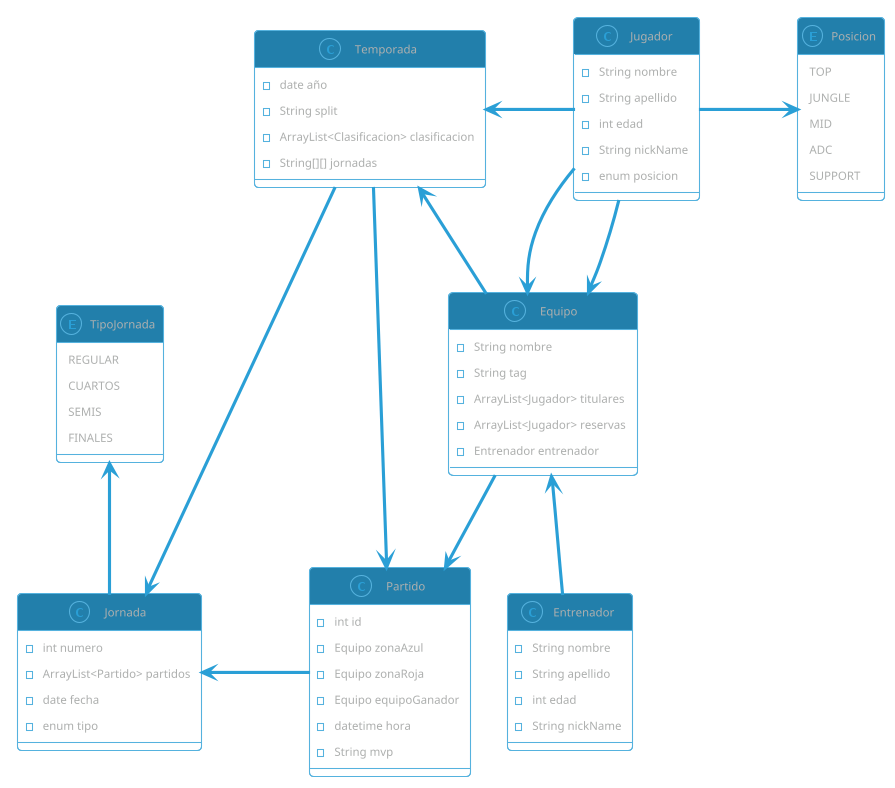

# Diagrama UML de las clases

```plantuml
@startuml
!theme cyborg-outline
class Jugador {
    - String nombre
    - String apellido
    - int edad
    - String nickName
    - enum posicion
}

enum Posicion {
    TOP
    JUNGLE
    MID
    ADC
    SUPPORT
}

class Equipo {
    - String nombre
    - String tag
    - ArrayList<Jugador> titulares
    - ArrayList<Jugador> reservas
    - Entrenador entrenador
}

class Entrenador {
    - String nombre
    - String apellido
    - int edad
    - String nickName
}

class Partido {
    - int id
    - Equipo zonaAzul
    - Equipo zonaRoja
    - Equipo equipoGanador
    - datetime hora
    - String mvp
}

class Jornada {
    - int numero
    - ArrayList<Partido> partidos
    - date fecha
    - enum tipo
}

enum TipoJornada {
    REGULAR
    CUARTOS
    SEMIS
    FINALES
}

class Temporada {
    - date año
    - String split
    - ArrayList<Clasificacion> clasificacion
    - String[][] jornadas
}

Jugador -down-> "5" Equipo : titulares
Jugador -down-> "*" Equipo : reservas
Jugador -right-> "1" Posicion : posicion

Equipo -down-> Partido : juega
Equipo "1" <-down- Entrenador : entrena

Jornada -up-> TipoJornada : tipo

Partido -left-> Jornada : pertenece

Temporada -right-> Jornada : tiene
Temporada -right-> Partido : tiene
Temporada <-right- Jugador : juegan
Temporada <-right- Equipo : juegan

@enduml
```
